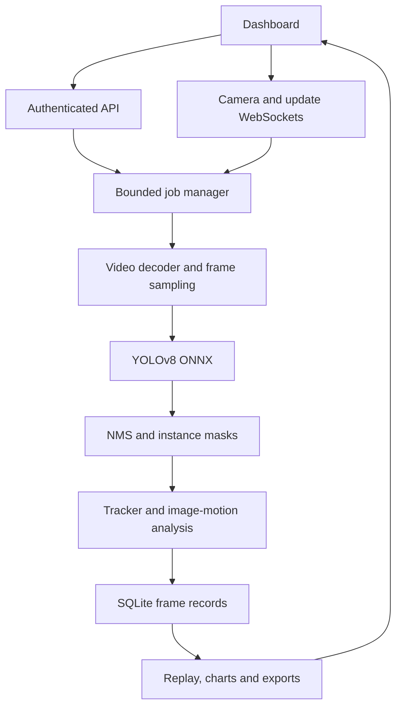

# Architecture

This is a single-node service with an offline, same-origin HTML/CSS/JavaScript dashboard and a FastAPI API. ONNX Runtime performs CPU inference. SQLite in WAL mode stores users, hashed sessions, media metadata, job configurations, per-frame predictions, source-frame annotations, settings and audit events.

## Inference and coordinate convention

Video files are read by a bounded thread pool, never by the HTTP event loop. Each decoded sampled frame is resized to fit 1280×1280 while preserving its aspect ratio. YOLO's 640×640 input uses centered letterboxing, BGR→RGB conversion and normalization to [0,1]. A static raw segmentation export returns `(1,116,8400)` detections and `(1,32,160,160)` mask prototypes for the built-in 80-class model.

Postprocessing selects the highest-scoring class, filters generic vehicles, applies class-aware NMS, maps boxes out of the letterbox, multiplies mask coefficients by learned prototypes, upsamples mask logits and thresholds them. Masks are cropped to their boxes. Actual raster-mask area is stored separately from bounding-box area. Compressed external contours and hole contours are persisted for replay. JPEG visualizations can have minor contour approximation and compression differences from the original raster masks.

The image-space tracker uses class-aware greedy assignment scored by IoU and predicted-center proximity. It retains a track for up to two seconds without observation and smooths velocity with EMA. This tracker is implemented directly; the package does not call it ByteTrack or claim re-identification capability. New tracks start at zero velocity. IDs are unique only within one run, and a long occlusion or class flicker can produce a new ID.

`direction_image_deg = atan2(vy,vx) mod 360`, with positive Y downward. Motion is not corrected for UAV camera movement. Group candidates are connected components of sufficiently close tracks with aligned nontrivial motion and at least three observations. The system does not estimate a calibrated convoy probability.

## Persistence and worker lifecycle

- A run stores its full settings before the worker starts.
- File analysis stores frame metadata and polygons. Original replay frames are read from the immutable uploaded video at their saved source-frame indexes.
- Camera analysis additionally stores analyzed JPEG frames for replay.
- Pause stops processing; stop requests are checked between frames. A running ONNX call completes before a file worker exits.
- Restart marks unfinished runs `interrupted`. Saved frames remain replayable; automatic resumable worker state is not claimed.
- Idle camera sessions pause after disconnect and expire after 60 seconds without frames. Limits also cap live session duration and analyzed-frame count.
- Only active runs remain in memory. Completed results are retrieved from SQLite.

## Security and deployment boundary

Passwords use PBKDF2-HMAC-SHA256 with per-password random salts and 600,000 iterations. Only hashed session tokens are persisted. Mutation requests require the session's CSRF value. Browser WebSocket origins are checked; live ingestion also performs a CSRF handshake and validates JPEG dimensions before decoding. Uploads require a length header, extension/codec validation and configured size quotas. Model files are local administrator-reviewed ONNX exports with a SHA-256 allowlist; no model-upload endpoint exists.

All authenticated users in this single workspace can view its media and runs. Operators can create runs and annotate/delete their own media or runs; admins can manage all items and workspace defaults. Viewers have read-only access. This is not a multi-tenant SaaS isolation design.

Use one Uvicorn worker. The app's in-memory worker coordination and upload mutex are not distributed locks. Before scale-out, replace them with a persistent queue, external worker service, object storage, PostgreSQL, resource scheduling and per-tenant authorization. Do not scale replicas by copying this process unchanged.

